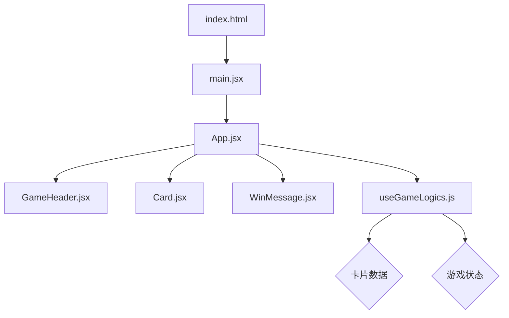
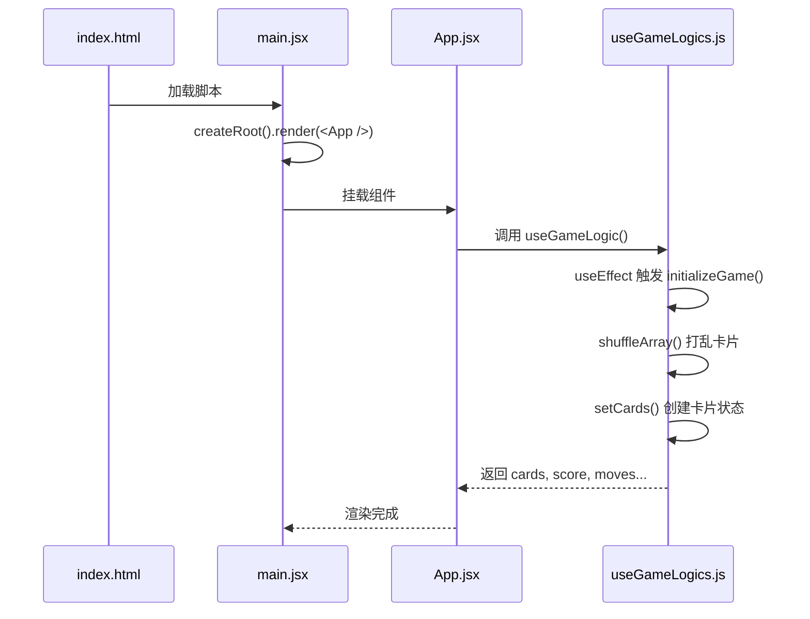
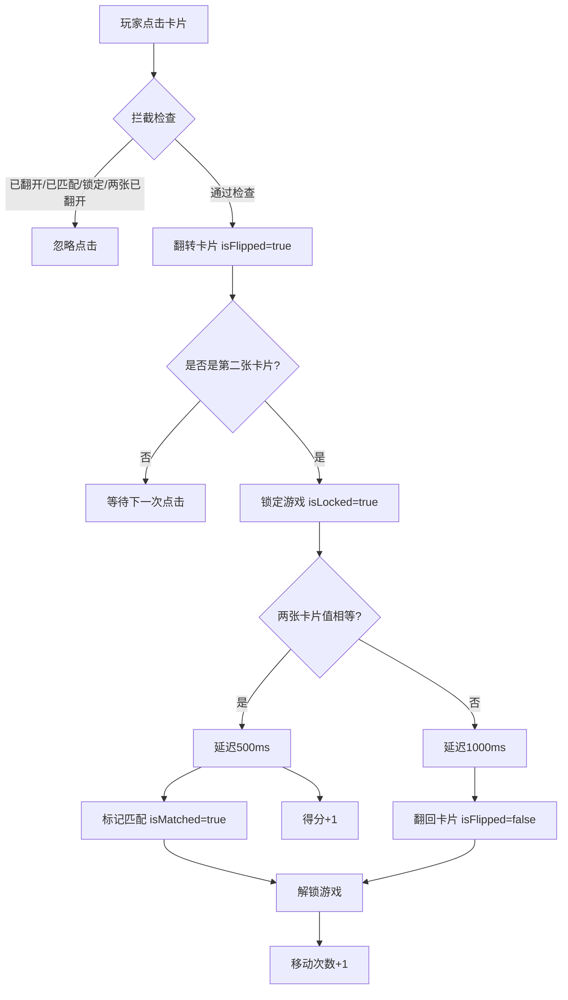
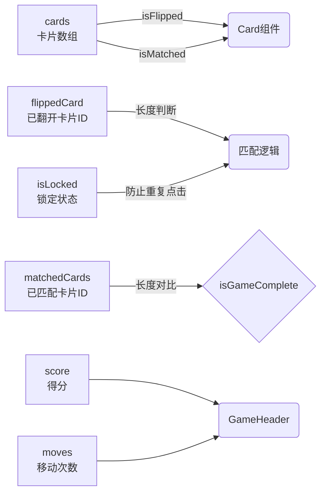
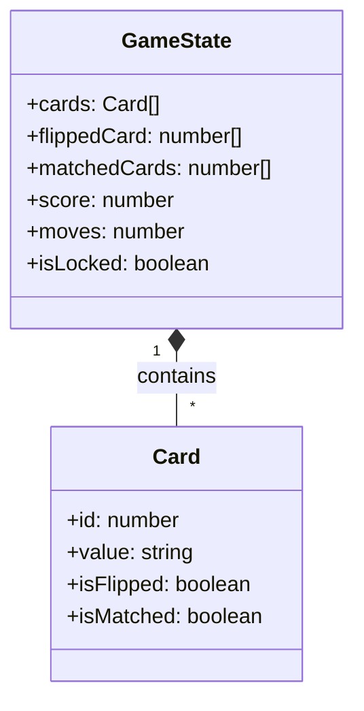
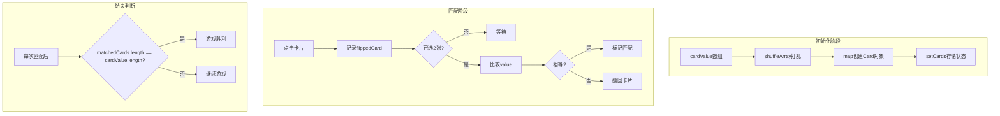
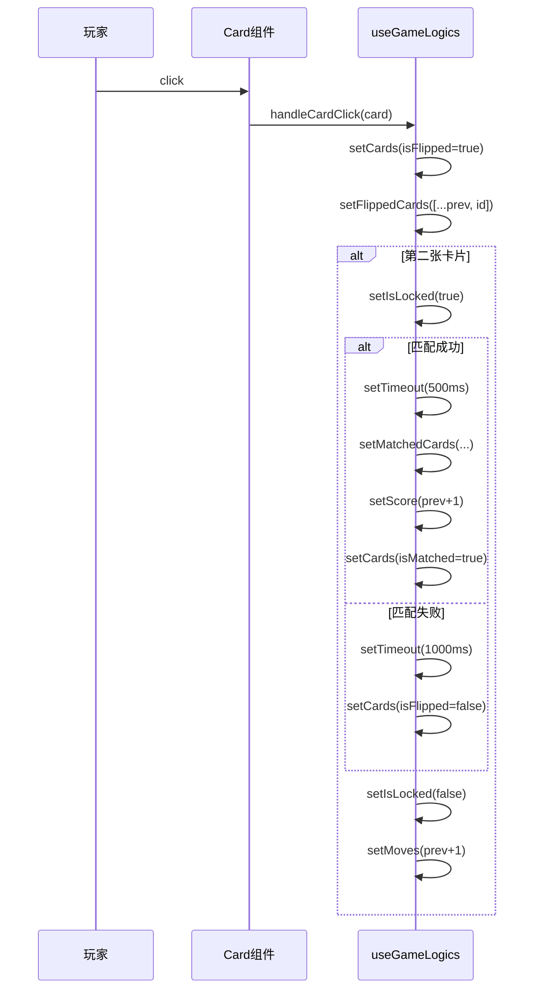

# Memory Card Game 项目逻辑介绍

## 一、项目架构概览

## 二、文件职责说明

| 文件 | 职责 | 类型 |
|------|------|------|
| `index.html` | 入口 HTML，定义根容器 | HTML |
| `main.jsx` | React 应用入口，挂载根组件 | React |
| `App.jsx` | 根组件，整合所有子组件 | React |
| `GameHeader.jsx` | 游戏头部，显示得分和移动次数 | Component |
| `Card.jsx` | 卡片组件，处理翻转动画 | Component |
| `WinMessage.jsx` | 胜利提示组件 | Component |
| `useGameLogics.js` | 游戏核心逻辑 Hook | Custom Hook |

## 三、游戏启动流程

## 四、卡片点击交互流程

## 五、状态管理关系

## 六、核心数据结构

## 七、匹配算法流程图

## 八、状态更新时序

